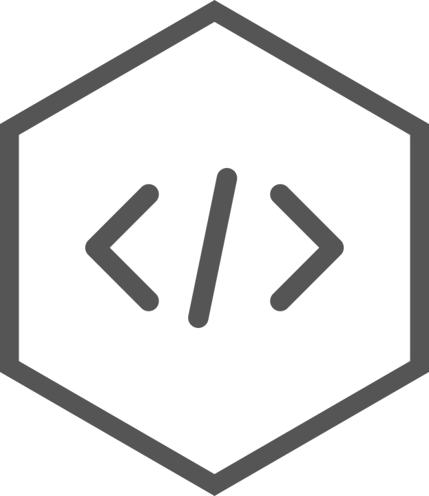

# api-test-model-V1.1.0
Api test model project in Node.js and Express.js.

# Hexagon

# Instructions

## Install packages

``
$ npm init
``
``
$ npm install express --save
``
``
$ npm install express-generator -g
``
``
$ npm install -D nodemon
``
``
$ npm install mongoose --save
``
``
$ npm install require-dir
``
``
$ npm install mongoose-paginate
``
``
$ npm install cors
``
## Options
``
$ express -h

  Usage: express [options][dir]
  
  Options:
  
    -h, --help          output usage information
    
        --version       output the version number
        
    -e, --ejs           add ejs engine support
    
        --hbs           add handlebars engine support
        
        --pug           add pug engine support
        
    -H, --hogan         add hogan.js engine support
    
        --no-view       generate without view engine
        
    -v, --view <engine> add view <engine> support (ejs|hbs|hjs|jade|pug|twig|vash) (defaults to jade)
    
    -c, --css <engine>  add stylesheet <engine> support (less|stylus|compass|sass) (defaults to plain css)
    
        --git           add .gitignore
        
    -f, --force         force on non-empty directory
``
## Create app

``
$ express --view=ejs myapp
``
## Starting app
``
$ DEBUG=myapp:* npm start
``
or with nodemon
``
$ nodemon
``

